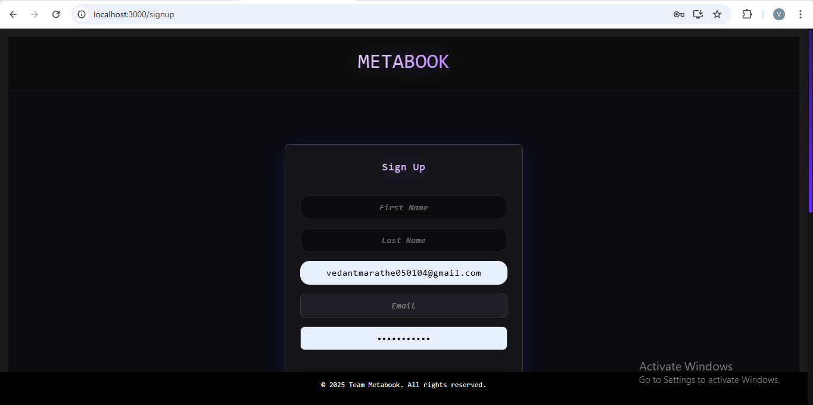
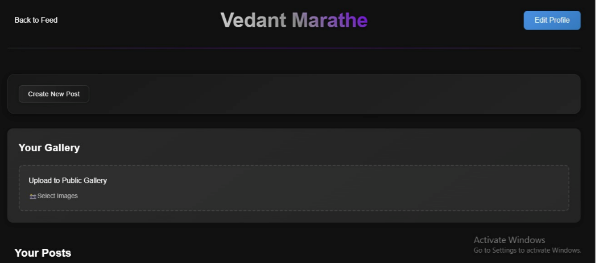
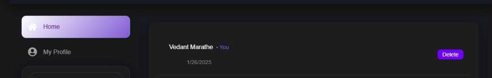
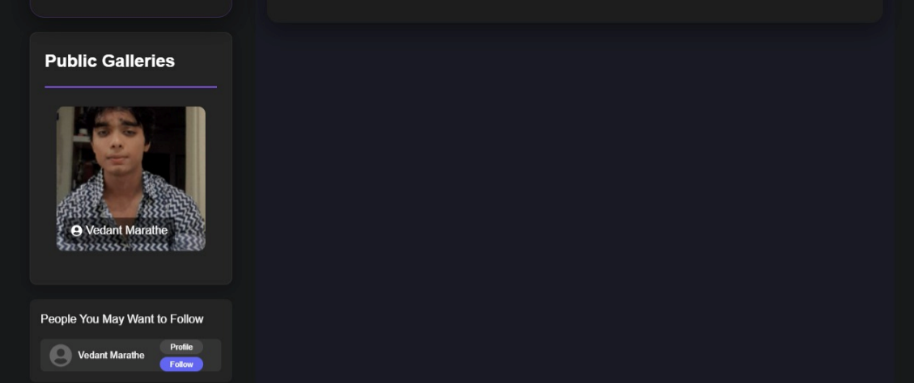

# 🧠 Metabook | Facebook Clone

A full-stack **Facebook clone** built using the **MERN stack** with essential features like user authentication (with OTP), profile management, real-time feed updates, and friend request handling.

## 📸 Features

### 🔐 Authentication
- Secure **JWT-based login and registration**
- **OTP verification** via email for account confirmation and password reset
- Encrypted password storage using **bcrypt**

### 👤 User Profiles
- Create and edit personal profiles with bio, profile photo, and cover photo
- Public profile view for friends and visitors
- Private details accessible only to the user

### 📰 Feed Management
- Create, edit, and delete posts with text and image support
- View your feed with posts from friends
- Like and comment on posts

### 🤝 Friend System
- Send, accept, or reject friend requests
- View your list of friends and mutual connections
- Notification on new friend requests

### ⚙️ Additional Features
- OTP resend with cooldown
- Protected routes for logged-in users
- RESTful API structure
- Responsive front-end with a clean UI

---

## 🛠️ Tech Stack

| Tech      | Usage |
|-----------|-------|
| **MongoDB** | Database for storing users, posts, and relationships |
| **Express.js** | Backend API framework |
| **React.js** | Frontend UI |
| **Node.js** | Backend runtime |
| **JWT** | Secure user authentication |
| **Mongoose** | ODM for MongoDB |
| **Bcrypt.js** | Password hashing |
| **Nodemailer** | Sending OTPs via email |
| **Axios** | HTTP requests from React |
| **Cloudinary / Multer** | Image upload and storage (optional) |

## 🖼️ A few screenshots

### 🔐 Login Page

### 👤 Profile Page

### 📰 Feed Page

